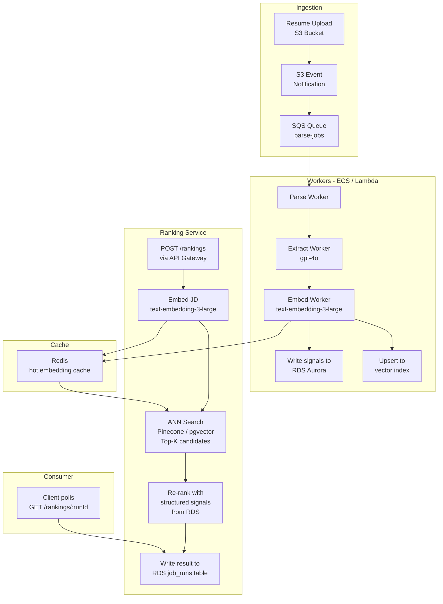

# DESIGN.md — Talent Intelligence & Ranking Engine

## 1. Purpose & Scope

This POC replaces a keyword-matching recruitment system with an AI-native pipeline that ranks
candidates against a job description. Given one JD file and a directory of resume files
(PDF/DOCX), it returns a ranked Top-10 candidate list with per-candidate scores, sub-scores,
and human-readable match reasons — served via a thin HTTP API.

Everything runs on a single local machine. There is no cloud infrastructure, no persistent
database, no UI, and no authentication. Results are written to timestamped JSON files on disk;
job state is held in-memory for the lifetime of the server process.

**Non-goals (explicit):**
- OCR for scanned/image-based PDFs
- Non-English documents
- Multi-JD batch runs
- Historical feedback loops or model fine-tuning
- Authentication or authorization
- Any cloud service (S3, SQS, RDS) — these are documented in §11 as the production path

**Assumptions:**
- _Assumption_: Sample corpus is 8–10 resumes + 1 JD, all in PDF or DOCX format.
- _Assumption_: OpenAI API key is provided externally and set in the environment before startup.
- _Assumption_: The local machine has network access to `api.openai.com`.
- _Assumption_: File paths in API requests are resolvable from the server's working directory.

---

## 2. Requirements Traceability

| Assessment Theme | PRD Section | Implementation Anchor |
|---|---|---|
| Multi-format file parsing (PDF + DOCX, extensible) | §4.1 Parser Layer | `DocumentParser` interface + `ParserRegistry` |
| End-to-end pipeline (intake → parse → score → output) | §4 Architecture & Pipeline | `pipeline/` orchestrator |
| Top-10 ranked output with reasons | §5 Scoring Formula, §7 Output Schema | `ScoringEngine` + `OutputWriter` |
| Cold start (no historical data) | §6 Cold Start Reasoning | Structured LLM extraction + embedding fallback |
| Concurrency designed for scale | §4.4 Concurrency | `p-limit` pool; maps to SQS workers in production |
| REST API interface | §3 HTTP API Interface | Express routes `POST /api/v1/rankings`, `GET /api/v1/rankings/:runId` |
| Async job pattern | §4 Architecture, §4.4 | `JobStore` + detached async pipeline execution |
| Graceful failure handling | §8 Edge Cases, §9 Error Handling | `AppError` hierarchy + per-file skip list |

---

## 3. Architecture Overview

The system is a **modular Express monolith** built around a **staged data pipeline**.

The HTTP layer (Express) is a thin shell: it validates input, registers a job, and fires the
pipeline asynchronously without blocking the caller. The pipeline itself is a pure,
sequentially-staged function graph — each stage consumes the output of the previous and
produces a typed structure. Parser implementations sit behind a `DocumentParser` interface
(ports-and-adapters), so adding a new format (TXT, HTML) requires only a new class registered
in `ParserRegistry` — no changes to orchestration or scoring.

This style fits a 2–3 hour POC because: (a) there is no distributed state to coordinate,
(b) all concurrency is intra-process via `p-limit`, and (c) the same pipeline function that
runs inside the HTTP handler can be tested as a pure Node.js module. The architecture is
deliberately not production-grade — it trades durability and horizontal scale for simplicity
and buildability within the timebox. The production path is documented in §11.

---

## 4. System Context

### Actors and boundaries

```
┌──────────────────────────────────────────────────────────┐
│                     Local Machine                        │
│                                                          │
│   ┌─────────────┐    HTTP      ┌───────────────────┐     │
│   │  Operator   │─────────────▶│  Express Server   │     │
│   │ (curl/      │◀─────────────│  :3000            │     │
│   │  Postman)   │              └────────┬──────────┘     │
│   └─────────────┘                       │                │
│                                         │ reads          │
│   ┌─────────────────────┐               ▼                │
│   │  Local Filesystem   │◀──────────────────────────     │
│   │  inputs/ (JD+       │   writes output/*.json         │
│   │  resumes)           │   reads/writes                 │
│   │  output/*.json      │   .embedding-cache.json        │
│   └─────────────────────┘                                │
│                                                          │
└──────────────────────────────────┬───────────────────────┘
                                   │ HTTPS — leaves machine
                                   ▼
                        ┌──────────────────────┐
                        │   OpenAI API          │
                        │   gpt-4o              │
                        │   text-embedding-     │
                        │   3-large             │
                        └──────────────────────┘
```

The only network boundary is outbound HTTPS to `api.openai.com`. No inbound network traffic
from outside the local machine is expected or supported.

---

## 5. Data Flow

```mermaid
flowchart TD
    A([POST /api/v1/rankings]) --> B[Validate request\nzod schema + path checks]
    B --> C[Generate runId\ncrypto.randomUUID]
    C --> D[Set JobStore status: queued\nRespond 202 immediately]
    D --> E[Fire pipeline async\nno await]

    E --> F[Parse JD file\nPdfParser | DocxParser]
    F --> G{Parse success?}
    G -- No --> JDFAIL([Hard stop: set status failed])
    G -- Yes --> H[Extract JD signals\ngpt-4o · temp 0 · strict JSON schema\nmaxAttempts 3 · retry on 429 / 5xx / timeout]
    H --> H2[Embed JD full text\ntext-embedding-3-large · cached]
    H2 --> H3[Build JD summary text\nrole · domain · seniority · must-haves\nEmbed summary · cached]
    H3 --> I{must_haves empty?}
    I -- Yes --> J[WARN: switch to\nembedding_only mode]
    I -- No --> K[full scoring mode]
    J & K --> L

    L[Scan resumesDir\nfor PDF + DOCX files] --> M[SHA-256 dedup\nremove duplicate raw text]
    M --> N[p-limit pool\nconcurrency = N]

    N --> O1[Resume 1\nparse → extract → embed full + summary]
    N --> O2[Resume 2\nparse → extract → embed full + summary]
    N --> O3[Resume N\nparse → extract → embed full + summary]

    O1 & O2 & O3 --> P[For each resume:\nCheck embedding cache\nsha256 key hit?]
    P -- Cache hit --> Q[Read vector from\n.embedding-cache.json\natomic write · process lock]
    P -- Cache miss --> R[Call OpenAI\ntext-embedding-3-large\nwrite to cache atomically]
    Q & R --> S[Grounding check\nremove hallucinated skills]

    S --> T[ScoringEngine\nexpanded evidence: skills + titles +\nhighlights + raw text · alias map\ncurved must-have penalty\nseniority penalty\nblended embedding similarity]
    T --> U[Sort descending · tie-break]
    U --> RERANK{Reranker\ntop-30 window\ngpt-4o · temp 0}
    RERANK -- Success --> RERANK_OK[LLM-ordered Top-10]
    RERANK -- Failure / timeout --> RERANK_FALL[Algorithmic order fallback]
    RERANK_OK & RERANK_FALL --> V[OutputWriter\nranked-ts.json\nskipped-ts.json]
    V --> W[Set JobStore\nstatus: completed\nresult: RankedOutput]

    style JDFAIL fill:#f66,color:#fff
    style J fill:#fa3,color:#fff
    style RERANK_FALL fill:#fa3,color:#fff
```

---

## 6. Component Design

### `src/config/`
- **Responsibility**: Load environment variables (`OPENAI_API_KEY`, `PORT`) at startup via
  `dotenv`; expose typed config constants (concurrency limits, timeout, token budgets).
  Model names are centralized in `src/config/models.ts` — single source of truth.
- **Input**: `process.env`
- **Output**: Frozen config object. `PORT` is validated at startup; `OPENAI_API_KEY` is
  deferred — the server binds and the health endpoint is live even without a key. Routes
  that trigger OpenAI calls throw `ConfigError` lazily when the key is missing.

### `src/routes/`
- **Responsibility**: Express routers only — no business logic. `rankingsRouter` handles
  `POST /api/v1/rankings` and `GET /api/v1/rankings/:runId`. `healthRouter` handles
  `GET /api/v1/health`.
- **Input**: Raw HTTP request
- **Output**: HTTP response; delegates to `JobStore` and `pipeline/`
- **Key constraint**: Routes call `zod` schema parse before touching any service. Invalid
  bodies are rejected at the boundary — no validation logic leaks downstream.

### `src/middleware/`
- **Responsibility**: `requestLogger` (log method + path + status), `errorHandler` (catches
  `AppError` and unhandled errors; maps to structured JSON response with correct status code).
- **Key dependency**: `AppError` hierarchy from `src/errors/`

### `src/jobs/` — Job Store
- **Responsibility**: Module-level `Map<string, JobRecord>` holding job lifecycle state.
  Status transitions: `queued → running → completed | failed`.
- **Input**: `runId`, status updates, `RankedOutput`
- **Output**: `JobRecord` lookup for GET handler
- **Production analogy**: Maps to a Redis hash (`HSET job:{runId} status completed`) or a
  `job_runs` table row. The `Map` is the local equivalent — intentionally ephemeral.

### `src/parsers/` — Parser Layer
- **Responsibility**: Convert a file path to raw plain text.
- **Interface**:
  ```
  DocumentParser.parse(filePath) → Promise<ParseResult>
  ```
- `PdfParser`: uses `pdf-parse`; rejects if extracted text < 200 chars (image-based scan).
- `DocxParser`: uses `mammoth`; strips all markup.
- `ParserRegistry`: maps `.pdf` / `.docx` → parser; returns `success: false` for unknown extensions.
- **Extensibility**: Adding `.txt` or `.html` support requires only a new class + one
  `registry.register(...)` call. Zero changes to orchestration or scoring.

### `src/extraction/` — Extraction Layer
- **Responsibility**: Call `gpt-4o` (temperature 0, strict JSON schema output + Zod as
  second-line validation) to extract structured signals from raw text.
- `JdExtractor` → `JobDescriptionSignals` (must-haves, nice-to-haves, seniority, domain, role title)
- `ResumeExtractor` → `ResumeSignals` (skills, titles, years of experience, highlights)
- Prompts are string constants in `src/extraction/prompts.ts` — not inline in callers.
- Text is truncated (first 12 K + last 12 K chars) before any API call to respect token budgets.
- Grounding check removes extracted skills that are not substrings of the raw resume text
  (hallucination filter — zero extra API calls).
- **Retry**: `withRetry(fn, maxAttempts=3, initialBackoffMs)` — retries on HTTP 429, 5xx,
  and timeout errors only; non-retryable errors fail immediately.

### `src/embeddings/` — Embedding Layer
- **Responsibility**: Generate and cache high-dimensional vectors for raw document text.
- Model: `text-embedding-3-large`.
- Cache: reads/writes `output/.embedding-cache.json` keyed by `sha256(rawText)`.
- On cache hit: returns stored vector immediately — no API call.
- On cache miss: calls OpenAI, writes cache atomically (temp file → `fs.rename`) under a
  process-wide async lock to prevent concurrent write races.
- On corrupted cache entry: logs warning, evicts entry, recomputes.
- **Retry**: same policy as extraction — `maxAttempts: 3`, retries on 429/5xx/timeout.

### `src/scoring/` — Scoring Engine
- **Responsibility**: Compute `final_score`, all sub-scores, match/gap lists, and reason
  string for each `CandidateRecord` against `JobDescriptionSignals`.
- Pure function: `score(candidate, jdSignals, jdEmbedding, jdSummaryEmbedding) → ScoredCandidate`
- No I/O, no side effects — independently testable.
- Evidence sources for overlap: extracted skills, job titles, highlights, and normalized raw text.
- Synonym/alias expansion via `src/scoring/synonyms.ts` before overlap checks (e.g. `K8s` ↔
  `Kubernetes`, `Postgres` ↔ `PostgreSQL`). Requirements match if any source or alias matches.
- Embedding similarity blends full-document vector (70%) and summary vector (30%).
- See §7 for the exact formula and all penalties.

### `src/scoring/Reranker` — LLM Rerank Stage
- **Responsibility**: After fast algorithmic scoring, take the top `rerankCandidateWindow`
  candidates (default 30) and ask `gpt-4o` to reorder them into a final Top-10 using a
  fixed rubric (must-have coverage, seniority alignment, evidence breadth).
- Temperature 0; strict JSON schema output; `withTimeout` wraps the call.
- Fallback: if the reranker returns invalid JSON, times out, or the ranked IDs cannot be
  resolved, the pipeline silently falls back to the algorithmic order — no job failure.

### `src/pipeline/` — Orchestrator
- **Responsibility**: Compose all stages in order — parse, extract, embed (full + summary),
  score, rerank, write output; manage `p-limit` concurrency pool for resume processing;
  update `JobStore` at each lifecycle transition.
- **Concurrency analogy**: Each slot in the `p-limit` pool is the local equivalent of one
  SQS worker. Setting `concurrency: 3` in the request means at most 3 resumes are in-flight
  with OpenAI simultaneously — directly mirroring a 3-worker ECS task definition.

### `src/output/` — Output Writer
- **Responsibility**: Serialize `RankedOutput` and `SkippedOutput` to timestamped JSON files
  in `output/`. Creates `output/` directory if absent. Never overwrites existing files
  (timestamped names guarantee uniqueness).

### `src/utils/`
- `withRetry(fn, maxAttempts, initialBackoffMs)` — exponential backoff; retries only on
  retryable conditions (HTTP 429, 5xx, `TimeoutError`); non-retryable errors fail immediately
- `withTimeout(promise, ms)` — rejects with `TimeoutError` if the promise does not settle
  in time; used to bound every OpenAI call
- `truncateText(text, maxChars)` — first N + last N strategy; logs warning when activated
- `sha256(text)` — cache keying + deduplication
- `clamp(value, min, max)` — score bounding
- `cosineSimilarity(a, b)` — dot product / (‖a‖ × ‖b‖)

---

## 7. Key Algorithms

### 7.1 Scoring Formula

All sub-scores are normalized to [0, 1] before weighting.

| Component | Weight — `full` mode | Weight — `embedding_only` mode |
|---|---|---|
| Must-have overlap | 0.50 | 0.00 |
| Embedding cosine similarity | 0.35 | 1.00 |
| Nice-to-have overlap | 0.15 | 0.00 |

`embedding_only` mode activates when `JobDescriptionSignals.must_haves` is empty (sparse JD).

**Must-have overlap** — a requirement counts as matched if it matches any evidence source
(skills, titles, highlights, or normalized raw resume text), after alias expansion:
```
overlap_score = matched_must_haves_count / total_must_haves_count
```

**Must-have penalty** — steeper-than-linear curve penalizes broad gaps more aggressively
while maintaining a strict floor:
```
missing_ratio = missing_must_haves / total_must_haves
must_have_penalty = max(-0.35 × missing_ratio^1.35, -0.35)
```
Example: 2/4 missing → penalty ≈ −0.124; 4/4 missing → penalty = −0.35 (floor).

**Seniority penalty** — applied when the JD's `seniority_level` clearly exceeds the
candidate's `years_of_experience`. Rules (conservative to avoid false negatives):
- JD requires senior/lead/principal AND candidate has < 3 years → penalty = −0.08
- JD requires mid-level AND candidate has < 1 year → penalty = −0.04
- All other cases → penalty = 0

**Blended embedding similarity** — combines full-document and summary-level signals:
```
embedding_similarity = (0.70 × cosine(jdFullEmbed, resumeFullEmbed))
                     + (0.30 × cosine(jdSummaryEmbed, resumeSummaryEmbed))
```
Summary text is a compact string built from role title, domain, seniority, and top
must-haves (JD side) or job titles and top skills (resume side).

**Final score:**
```
total_penalty = must_have_penalty + seniority_penalty

weighted_sum = (0.50 × must_have_overlap)
             + (0.35 × embedding_similarity)
             + (0.15 × nice_to_have_overlap)

final = clamp(weighted_sum + total_penalty, 0, 1)  →  rounded to 4 decimal places
```

**Tie-breaking (deterministic):**
1. Higher `embedding_similarity` descending.
2. Filename alphabetically ascending.

### 7.2 Alias Expansion

Before overlap checks, both JD requirements and candidate evidence are expanded with a
synonym map (`src/scoring/synonyms.ts`). Examples: `K8s` ↔ `Kubernetes`, `Postgres` ↔
`PostgreSQL`, `JS` ↔ `JavaScript`. A requirement counts as matched if the original term
or any alias appears in any evidence source. No double-counting — matched once, counted once.

### 7.3 Embedding Similarity

```
cosine_similarity(a, b) = dot_product(a, b) / (‖a‖ × ‖b‖)
```

Result is in [−1, 1]; in practice all document embeddings from `text-embedding-3-large`
are non-negative in the domain of professional text, giving an effective range of [0, 1].
Computed in-process via `src/utils/similarity.ts`. No external library required.

### 7.4 Grounding Check

After LLM extraction of `ResumeSignals.skills`, each extracted skill is verified:

```
keep skill iff skill.toLowerCase() is a substring of rawResumeText.toLowerCase()
```

Any skill that fails this check is removed before scoring. This is a lightweight
hallucination filter with zero additional API calls. It will miss paraphrased equivalents
(known limitation — see §12).

### 7.5 Overlap Matching (Fuzzy Substring + Multi-Source)

A JD requirement `R` is considered matched if any of the following is true for the
candidate (after alias expansion on both sides):
```
1. R matches a skill:     R.toLowerCase().includes(skill) OR skill.includes(R.toLowerCase())
2. R matches a title:     same fuzzy rule applied to each job title
3. R matches a highlight: same fuzzy rule applied to each highlight phrase
4. R matches raw text:    normalizedResumeText.includes(normalize(R))
```

No external library. Deterministic, auditable. A requirement is counted at most once
regardless of how many sources it appears in.

### 7.6 Cold Start

No training data or historical hires are required. The system handles cold start through:

1. **Explicit extraction**: The LLM externalizes must-haves from the JD text itself.
   The signals are inherent in the document, not learned from past data.
2. **Semantic embeddings**: Captures semantic intent beyond keyword frequency; candidates
   using equivalent terminology still score well.
3. **Graceful degradation**: Sparse JD → automatic `embedding_only` mode → no undefined
   or zero output.

**Known calibration gap**: Weights (50/35/15) are heuristic. The production path to
calibrate them: collect recruiter accept/reject labels per run → fit a logistic regression
on sub-scores → replace hardcoded weights with learned coefficients → A/B test variants.

---

## 8. Data & Storage

### Local Artifacts

| Path | Format | Purpose | Gitignored? |
|---|---|---|---|
| `inputs/` | PDF, DOCX | JD + resume source files | Recommended if PII present |
| `output/ranked-<ts>.json` | JSON | Ranked Top-10 result for each run | Yes |
| `output/skipped-<ts>.json` | JSON | Files that failed parse or extract | Yes |
| `output/.embedding-cache.json` | JSON | Embedding vector cache | Yes |
| `.env` | Key=value | `OPENAI_API_KEY`, `PORT` | Yes (always) |
| `.env.example` | Key=value | Template with empty values | No |

### Embedding Cache Format

```json
{
  "<sha256-of-raw-text>": [0.0012, -0.0234, ..., 0.0087],
  "<sha256-of-raw-text>": [...]
}
```

Key is `sha256(rawText)` — the same file with identical content always hits the cache
regardless of filename. This also drives deduplication: two resume files with the same
SHA-256 are treated as one candidate before any API call is made.

### Output File Naming

`ranked-<ISO8601-timestamp>.json` — e.g. `ranked-2026-04-13T10-00-00Z.json`. Timestamped
to prevent silent overwrites on repeated runs against the same inputs.

---

## 9. External Integrations

### OpenAI API

| Usage | Model | Mode | Temperature | Max tokens |
|---|---|---|---|---|
| JD structured extraction | `gpt-4o` | strict JSON schema | 0 | 1 024 |
| Resume structured extraction | `gpt-4o` | strict JSON schema | 0 | 1 024 |
| Candidate reranking | `gpt-4o` | strict JSON schema | 0 | 512 |
| Embedding generation | `text-embedding-3-large` | — | — | — |

**Retry policy** (uniform across all OpenAI calls):
- `maxAttempts: 3`, initial backoff 1 s, doubles each attempt (1 s → 2 s → 4 s).
- Retries only on retryable conditions: HTTP 429 (rate limit), HTTP 5xx (server error),
  and `TimeoutError` (call exceeded `openAiTimeoutMs`).
- Non-retryable errors (e.g. HTTP 400, invalid model, Zod validation failure) fail immediately
  without consuming retry budget.
- JD extraction exhausting all 3 attempts → hard stop (job status `failed`).
- Resume extraction or embedding exhausting all 3 attempts → file added to `skipped` list;
  run continues with remaining candidates.
- Reranker exhausting all 3 attempts or returning invalid schema → silent fallback to
  algorithmic order; job does NOT fail.

**API key handling:** Loaded from environment at startup via `dotenv`. The key is not
validated at server bind time — the server starts and `/api/v1/health` responds `200` even
if the key is absent. The OpenAI client throws `ConfigError` the first time a ranking
request triggers an API call, causing that job to transition to `failed` with a clear
message. This decoupling allows deployment readiness checks to pass before the key is
injected. Never logged, never included in API responses or output files.

---

## 10. Concurrency & Performance

### POC Limits

At sample scale (8–10 resumes + 1 JD), the total OpenAI calls are:
- 1 JD extraction call
- 2 JD embedding calls (full text + summary text — cache-backed after first run)
- Up to 10 resume extraction calls
- Up to 20 embedding calls per fresh run (full + summary per resume, minus cache hits)
- 1 reranker call (covers up to 30 candidates in a single prompt)

With `concurrency: 3` (default), at most 3 resumes are in-flight simultaneously.
Expected wall-clock time: 45–120 seconds depending on OpenAI latency and cache state.

### How Caching Reduces Calls

On a re-run with unchanged resumes, all embedding calls are served from
`output/.embedding-cache.json`. Only extraction calls (which are cheaper and faster)
repeat. A warm cache cuts total API calls by ~50%.

### Complexity

Scoring is O(N) — one score computation per candidate. Cosine similarity is O(D) per pair
where D is the embedding dimension (`text-embedding-3-large`). Sorting is O(N log N).
At POC scale (N ≤ 20), all of this is negligible. The bottleneck is always network I/O to
OpenAI. Reranking adds one additional LLM call of fixed cost regardless of N.

---

## 11. Production Architecture (Target State)

This section describes the target architecture for the full-scale system (50,000 candidates,
1,500 live roles). Nothing here is implemented in the POC.



### Key scaling decisions

**Vector index replaces brute-force cosine.** Brute-force cosine similarity over 50,000
candidates is O(N × D) per query. At N = 50,000, D = 1,536, with 1,500 concurrent roles,
this is infeasible in real time. The solution is a pre-built approximate nearest-neighbour
(ANN) index (Pinecone, pgvector with IVFFlat, or OpenSearch kNN). ANN search returns
Top-K candidates in O(log N) with controllable recall trade-off. The POC uses brute-force
cosine — this is documented as the known limit.

**Pre-compute embeddings, update incrementally.** Candidate embeddings are computed once
at resume upload and stored in the vector index. A re-embed is triggered only on profile
update. JD embeddings are computed at query time (cheap: 1 call per job post).

**Decouple ingestion from ranking.** A new resume uploaded to S3 triggers an SQS message
→ parse → extract → embed → index worker. The ranking service queries the pre-built index
at request time. These are independent scaling dimensions.

**Job run metadata in RDS.** The in-memory `JobStore` maps to a `job_runs` table:
`runId`, `status`, `jd_path`, `result_s3_key`, `created_at`, `completed_at`.
Results are stored in S3 (large JSON), with a pointer in RDS.

**Redis for hot embedding cache.** Candidate embeddings for frequently-queried profiles are
kept in Redis with a TTL. This reduces repetitive vector index lookups for popular candidates.

---

## 12. Reliability & Failure Modes

| Symptom | Root Cause | Detection | Mitigation |
|---|---|---|---|
| Run status stays `running` indefinitely | Unhandled exception in pipeline | No completion log entry; poll timeout | Top-level pipeline wrapped in try/catch/finally; always transitions to `failed` |
| Resume missing from ranked output | Parse failure (scan PDF, corrupt DOCX) | Entry in `skipped-<ts>.json` | Skip + log; run continues; evaluator inspects skipped file |
| JD extraction returns empty `must_haves` | Sparse or generic JD text | `WARN` log line; `scoring_mode: embedding_only` in output | Automatic fallback to `embedding_only` mode |
| JD extraction exhausts all 3 retry attempts | OpenAI outage / malformed response | `status: failed`, error message in job record | Hard stop; no partial ranked output produced |
| Resume extraction exhausts all 3 retry attempts | OpenAI transient error / rate limit | Entry in `skipped-<ts>.json` with reason | Skip + continue; other candidates unaffected |
| OpenAI call hangs indefinitely | Network stall or OpenAI slow response | No response within `openAiTimeoutMs` | `withTimeout` wraps every call; `TimeoutError` is retryable, counts against retry budget |
| OpenAI 429 rate limit | Concurrency too high or burst spike | HTTP 429 response code | Retry classified as retryable; exponential backoff 1 s → 2 s → 4 s; `concurrency` flag limits burst |
| Reranker returns invalid schema or times out | LLM output malformed; network timeout | Zod parse failure; `TimeoutError` | Silent fallback to algorithmic order; job completes normally |
| Server starts but ranking fails with `ConfigError` | `OPENAI_API_KEY` not set | `status: failed` with `code: CONFIG_ERROR` | Set `OPENAI_API_KEY` in `.env`; health check does not require the key |
| Hallucinated skill inflates score | LLM invents skill not in resume | Grounding check removes non-matching skills | Substring grounding check post-extraction; known gap for paraphrased equivalents |
| Embedding cache write race condition | Two goroutine-equivalent async tasks writing simultaneously | Data corruption in cache JSON | Process-wide async write lock + atomic `fs.rename` prevents concurrent writes |
| Embedding cache file corrupted | Partial write / disk error before fix | JSON.parse throws on load | Log warning, evict bad entry, recompute |
| Verbose resume scores higher than concise one | Length bias in extracted skill count | Manual inspection of output | Known limitation; mitigated in production by normalising skill count before scoring |
| Model drift | OpenAI silently updates model behaviour | Score distribution shift over time | Model names centralized in `src/config/models.ts`; update single constant to pin or upgrade |
| Large resume loses middle content | Truncation to token budget | Warning log on truncation | Retain first N + last N chars; log warning; known limitation for very dense resumes |

**Known calibration limits:**
- Weights (50/35/15) are heuristic. The `full` scoring mode assumes must-have overlap is
  the strongest hire predictor; this has not been validated against real hire data.
- Substring fuzzy matching will miss synonyms ("Postgres" vs "PostgreSQL Extended" is fine;
  "distributed systems" vs "large-scale infrastructure" is a miss).

---

## 13. Security & Privacy

- `OPENAI_API_KEY` is loaded from `.env` via `dotenv`. `.env` is gitignored. `.env.example`
  with empty values is the only committed reference.
- The key is validated lazily — the server binds without it, but the first ranking request
  that reaches the OpenAI client throws `ConfigError` with a clear human-readable message.
  The health endpoint is intentionally available without a key.
- No API key, token, or credential is written to logs, output files, or HTTP responses.
- Resume content (potentially PII) is sent to OpenAI's API for extraction and embedding.
  _Assumption_: The provided OpenAI key is covered by an appropriate data processing
  agreement for the purpose of this assessment. In production, PII handling requires explicit
  DPA review, data residency decisions, and possibly redaction before sending to third-party APIs.
- The AI interaction log committed to the repo must be reviewed before submission to ensure
  no candidate PII or API keys were captured in the chat transcript.
- No input sanitisation is required for local file paths beyond existence checks, since the
  server is not exposed to untrusted network callers in the POC.

---

## 14. Observability

### POC (what is logged now)

All log output is `console.log` / `console.error` to stdout with structured fields:

| Event | Fields logged |
|---|---|
| Server start | `port` |
| Request received | `method`, `path` |
| Job created | `runId`, `jdPath`, `resumesDir`, `concurrency` |
| File parsed | `file`, `wasTruncated`, `warnings[]` |
| File skipped | `file`, `reason` |
| OpenAI call | `type` (extract/embed), `file`, `attempt` |
| Retry triggered | `type`, `file`, `attempt`, `backoffMs` |
| Job completed | `runId`, `totalEvaluated`, `totalValid`, `durationMs` |
| Job failed | `runId`, `error` |

No PII (resume content, skills) is logged.

### Production additions

- **Correlation ID**: Generate a UUID per HTTP request; propagate through all log events and
  downstream OpenAI calls via a context store (AsyncLocalStorage). Makes request traces
  joinable in a log aggregator (Datadog, CloudWatch Logs Insights).
- **Structured JSON logging**: Replace `console.log` with a logger (pino) emitting NDJSON.
- **Metrics**: Counter for jobs started/completed/failed; histogram for pipeline duration;
  counter for OpenAI calls and retries; cache hit rate.
- **Distributed tracing**: OpenTelemetry spans per pipeline stage; exportable to Jaeger or
  Datadog APM.
- **Alerting**: PagerDuty alert if job failure rate > 5% over 5 minutes; alert if OpenAI
  retry rate > 20% (signals upstream degradation).

---

## 15. Testing Strategy

### What an evaluator can run

```bash
# 1. Install + build
pnpm install && pnpm build

# 2. Start server
cp .env.example .env          # then fill in OPENAI_API_KEY
node dist/server.js

# 3. Health check (should not require API key)
curl -s http://localhost:3000/api/v1/health

# 4. Submit a ranking job
curl -s -X POST http://localhost:3000/api/v1/rankings \
  -H "Content-Type: application/json" \
  -d '{"jdPath":"./inputs/job-description.docx","resumesDir":"./inputs/resumes/"}' \
  | jq .

# 5. Poll until completed
curl -s http://localhost:3000/api/v1/rankings/<runId> | jq .data.status
```

### Minimal test matrix

| Test Case | Input | Expected Outcome |
|---|---|---|
| Happy path — mixed PDF + DOCX | Valid JD + 8 resumes | `status: completed`; `top_candidates` length ≤ 10; all sub-scores present |
| Scan PDF in resume set | One image-only PDF among valid resumes | Scan file appears in `skipped`; other candidates ranked normally |
| Sparse JD (no clear must-haves) | Vague JD + valid resumes | `scoring_mode: embedding_only`; warn logged; ranked output still produced |
| Invalid request body | Missing `jdPath` | HTTP `400`; pipeline not triggered; `JobStore` unchanged |
| Invalid `jdPath` (not a file) | Path points to directory | HTTP `400` with `INVALID_PATH` code |
| Invalid `resumesDir` (not a directory) | Path points to file | HTTP `400` with `INVALID_PATH` code |
| Unknown `runId` poll | Random UUID in GET | HTTP `404` |
| Warm cache re-run | Same inputs as happy path | No embedding API calls (verify via log count); same scores as first run |
| Bad LLM JSON retry | _Simulated via unit test mock_ | Retry up to 3 attempts; third failure → skipped with reason |
| Reranker fails / invalid schema | _Mocked via unit test_ | Fallback to algorithmic order; `status: completed`; no job failure |
| Integration smoke (mocked OpenAI) | POST → poll → `completed` | Full lifecycle in `tests/` with `vitest` + `supertest`; mocked OpenAI calls |

### Unit test focus areas (for the ScoringEngine)

- `final = clamp(weighted_sum + total_penalty, 0, 1)` for known inputs
- `embedding_only` mode produces 0 for must-have and nice-to-have components
- Multi-source evidence: requirement matched via title or highlight counts once
- Alias expansion: `K8s` in JD matches `Kubernetes` in candidate evidence
- Seniority penalty: senior JD + 1-year candidate → penalty = −0.08
- Tie-breaking: two candidates at identical final score → lower filename sorts first
- Must-have penalty floor: 100% missing → penalty exactly −0.35

---

## 16. Trade-offs & Deliberate Cuts

| Decision | What was cut | Why | What to add with 1 more week |
|---|---|---|---|
| In-memory `JobStore` | Persistent DB for job runs | No DB setup time in a 3h POC; state is ephemeral by design | Swap `Map` for a `job_runs` SQLite table via `better-sqlite3` |
| Brute-force cosine | ANN vector index (Pinecone, pgvector) | Correct at N ≤ 20; infeasible at N = 50K | Add pgvector extension to a local Postgres instance; benchmark crossover point |
| No authentication | JWT middleware, API key header | Not in scope for local POC; no untrusted callers | Add `Authorization: Bearer` header check; rate limiting per key |
| Substring fuzzy match + alias map | Full semantic synonym expansion (embedding-based) | Alias map covers common tech abbreviations at zero cost; misses long-form paraphrasing | Use embedding similarity for skill-to-skill matching; add more aliases to `synonyms.ts` |
| Heuristic weights | ML-calibrated scoring weights | No labelled hire data available | Instrument output with recruiter accept/reject labels; fit logistic regression on sub-scores |
| No OCR | Scanned PDF support | Adds `tesseract` dependency and significant parsing time | Add `pdf2pic` + `tesseract.js` behind a feature flag; treat as optional parser |
| No prompt versioning | Prompt registry + version tracking | Acceptable for POC; prompts stored as constants | Move prompts to a versioned `prompts/` directory; log prompt hash with each API call |
| Single-JD runs | Multi-JD batch endpoint | Scope explicitly excluded | Add `POST /api/v1/rankings/batch` accepting an array of JD paths |
| `console.log` logging | Structured pino logger | Avoids a dependency; sufficient for POC | Replace with `pino`; add correlation ID via `AsyncLocalStorage` |

---

## Reviewer Checklist

- [ ] **Server runs locally**: `pnpm build && node dist/server.js` starts without error;
      `GET /api/v1/health` returns `200 { "status": "ok" }` — even without an API key.
- [ ] **End-to-end ranking**: `POST /api/v1/rankings` with `jdPath: ./inputs/job-description.docx`
      and `resumesDir: ./inputs/resumes/` completes with `status: completed` and ≥ 1 entry in
      `top_candidates`.
- [ ] **File format coverage**: Both PDF and DOCX resumes appear in the ranked output
      (or in `skipped` with an explicit reason if unreadable).
- [ ] **Output completeness**: Every ranked candidate has `final_score`, all sub-scores
      (`must_have_overlap`, `embedding_similarity`, `nice_to_have_overlap`,
      `must_have_penalty`, `seniority_misalignment_penalty`), `matched_must_haves`,
      `missing_must_haves`, `matched_nice_to_haves`, and a non-empty `reason` string.
- [ ] **Tests pass**: `pnpm test` exits 0 — health, validation (incl. path checks), scoring
      (alias expansion, seniority penalty, multi-source evidence), reranker fallback, and
      integration smoke test.
- [ ] **Scaling story**: §11 documents S3, SQS, ECS workers, RDS, Redis, and a vector index;
      explains when brute-force cosine stops working and what replaces it.
- [ ] **Failure modes**: §12 table covers parse failures, LLM extraction failures, timeouts,
      rate limits, reranker fallback, missing API key, cache race condition, cache corruption,
      and calibration limits — each with detection and mitigation.
- [ ] **No secrets in repo**: `git log` and full file tree contain no API keys; `.env` is
      gitignored; `.env.example` has only empty placeholders.
- [ ] **AI interaction log committed**: Full prompt/chat transcript is present in the
      repository and has been reviewed to ensure no PII or credentials are captured.

AI interaction log is committed at ai-logs/AI_INTERACTION_LOG.md and contains the full prompt/chat history used during implementation